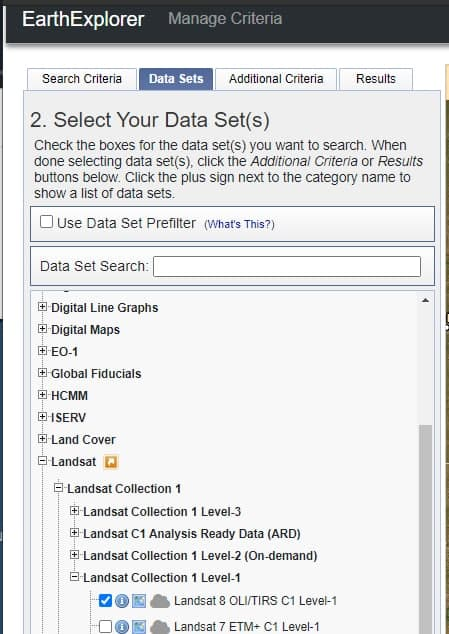
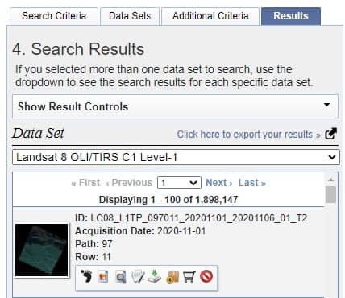
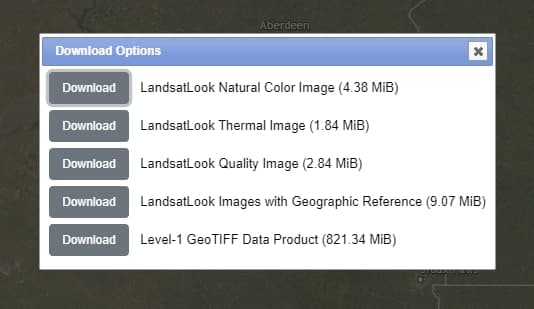

# Geographic Information Systems

<p align="center">

</p>

Geographic Information Systems project


## Installation

### Requirements

-   Create new environment
    ```bash
    virtualenv env
    ```
-   Install requirements
    ```bash
    pip install -r requirements.txt
    ```

### Database setup

-   Install PostgreSQL
-   Create database
    ```bash
    psql -U postgres
    > create database datacube;
    ```
-   Create configuration file in `~/.datacube.conf`

        ```toml
        [datacube]
        db_database: datacube

        # A blank host will use a local socket. Specify a hostname (such as localhost) to use TCP.
        db_hostname: localhost

        # Credentials are optional: you might have other Postgres authentication configured.
        # The default username otherwise is the current user id.
        db_username: datacube
        db_password: XXX
        ```

### Datacube installation

-   Install datacube

    ```bash
    cd datacube-core-develop
    python setup.py install
    ```

-   Initialize database schema

    ```bash
    datacube -v system init
    ```

### Dataset

Download data from the example in the docs:

-   Go to <https://earthexplorer.usgs.gov/>

-   Select "Landsat 8 OLI/TIRS C1 Level-1" data set

      

-   Click on the download icon for the first data piece

      

-   Download the necessary files

      

## Authors

### Team

-   **Samuele Ferri**: [Site](https://samuelexferri.com), [GitHub](https://github.com/samuelexferri)
-   **Lorenzo Conti**
-   **Fabio Sangregorio**
-   **Simone Sudati**

## Version


## License

[](https://badges.mit-license.org)
